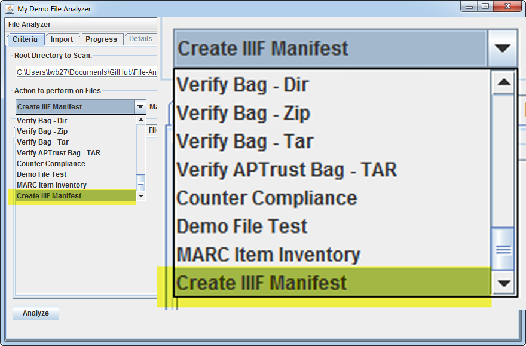
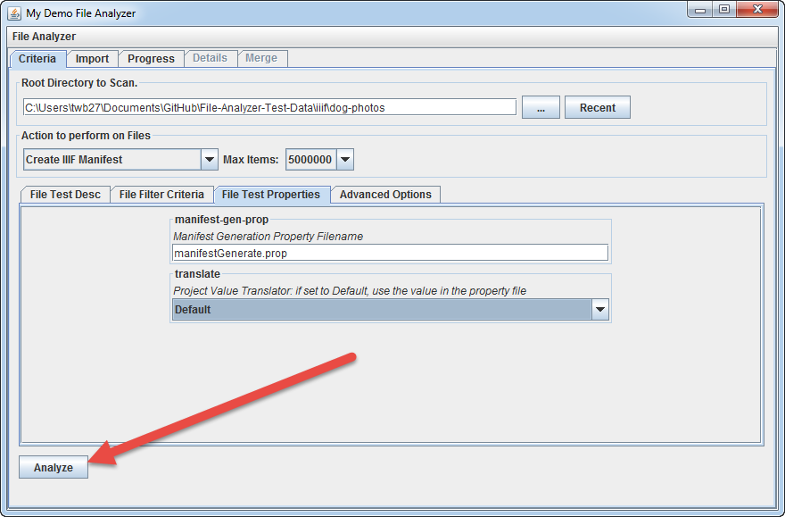
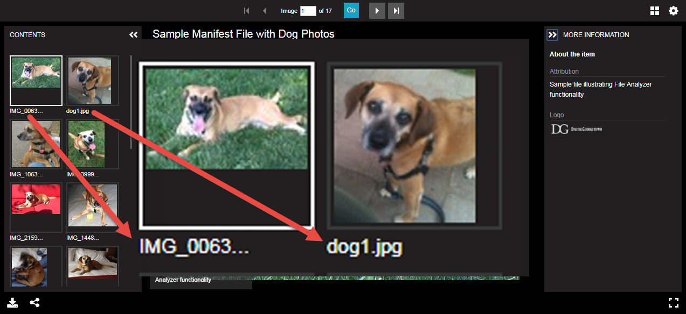
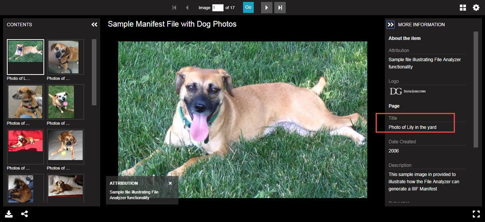
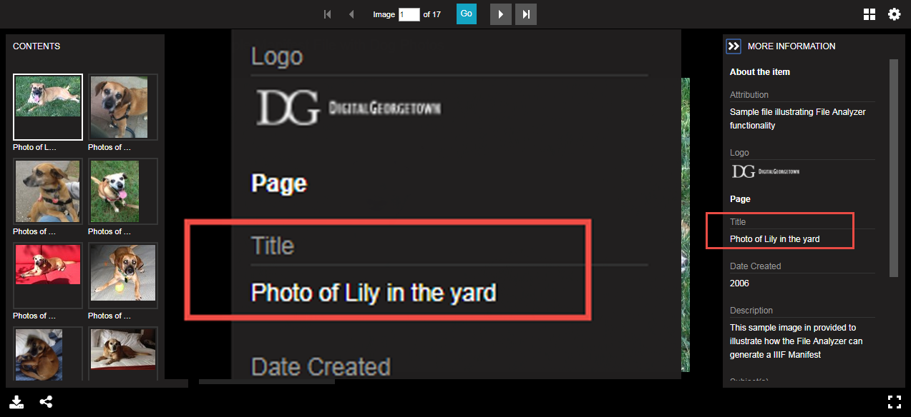
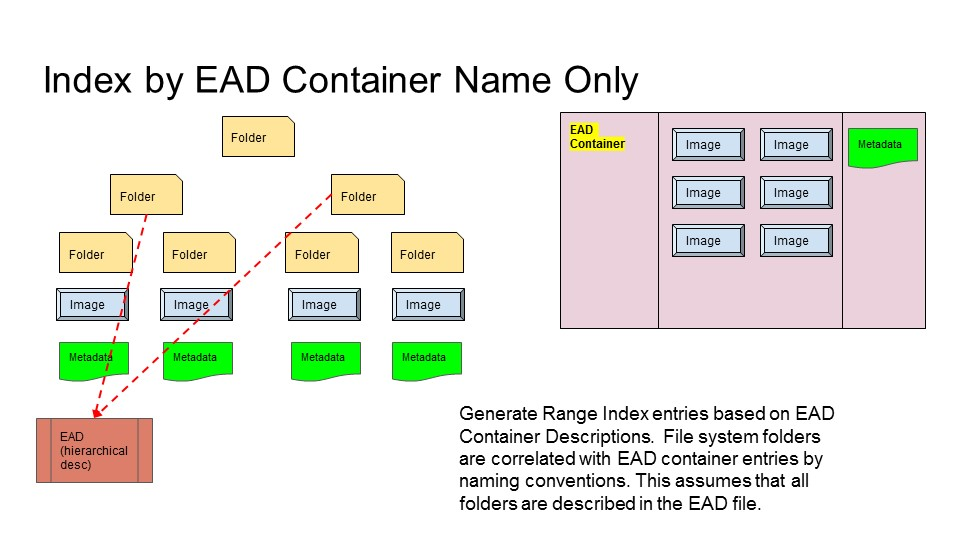
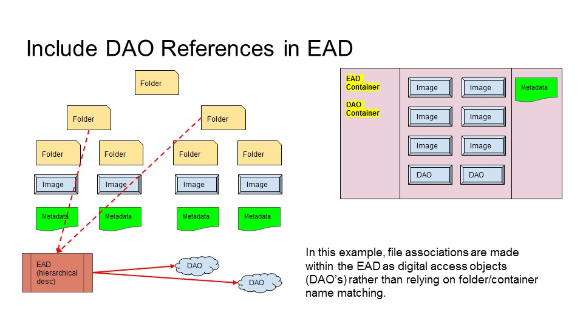
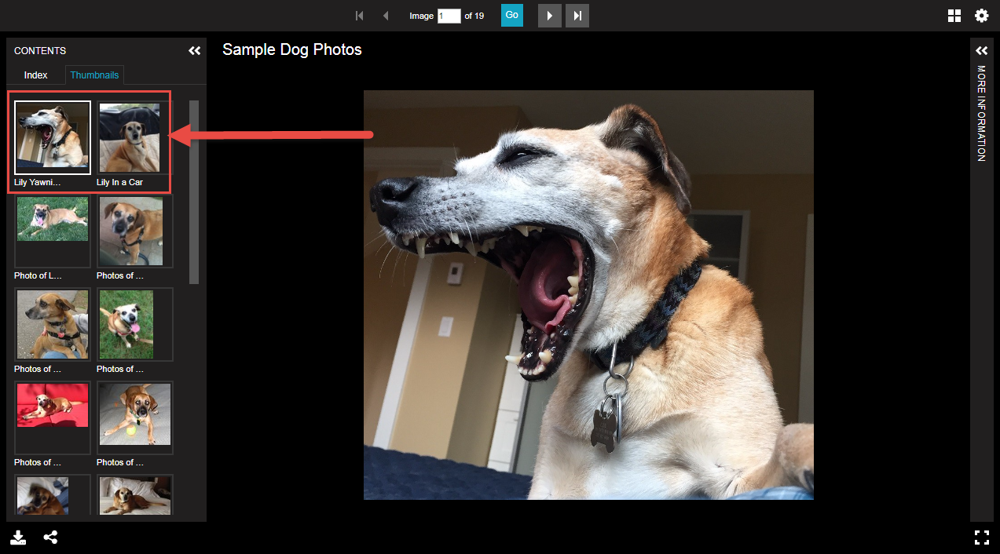
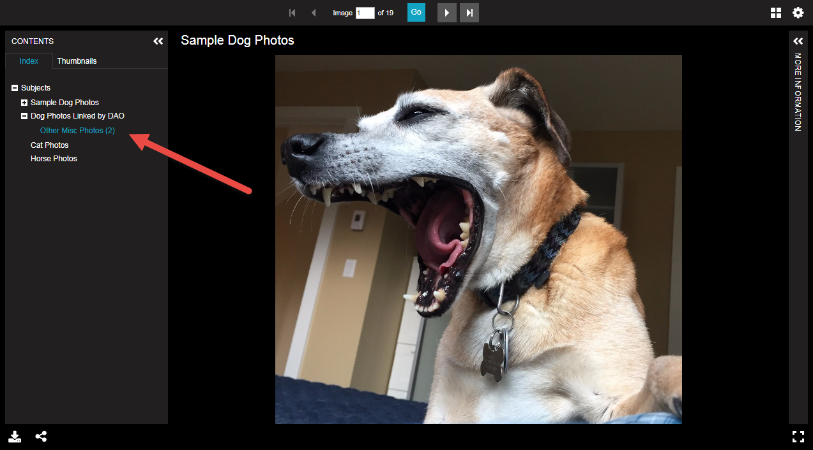

## Generating IIIF Manifests from Repository Metadata and Archival Metadata (EAD)

Terry Brady

Georgetown University Library

https://github.com/terrywbrady/info

---

## IIIF in DigitalGeorgetown

- March 2018 - First Collection Released
  - [Alliance for Progress Cartoon Book Program in Latin America Collection](https://repository.library.georgetown.edu/handle/10822/1044538#?m=7)
- Reasonably Sized Collection, Visually Interesting
  - Item Metadata in DSpace
- Next Steps
  - Usability Testing
  - Capacity Planning for Future Projects

+++

## Next Steps

- Law Collections Described in EAD
  - Digitized AIDS Papers (on Test Server, VPN Required)
- Difficult to represent as items in DSpace
- EAD Hierarchy to be represented in a manifest
- Instructed our plans

+++

## Possible Future Plans

- Combine digitized content with scholarship to tell a story
- Student newspaper archive

---

## Our Approach

- Re-use metadata wherever possible
- Assemble metadata and image files to facilitate manifest generation
  - Developer intervention not needed!
- Use our [File Analyzer](https://github.com/Georgetown-University-Libraries/File-Analyzer) application for automation 
- Try it yourself!
  - [Tutorial - Generating IIIF Manifests with File Analyzer](https://github.com/Georgetown-University-Libraries/File-Analyzer-Test-Data/blob/master/iiif/README.md)
- We hope this is useful for other institutions
  
+++?image=iiif/overview.png&size=auto 90%

---

## Manifest Generation Property File

@ul

- Root Path to IIIF Server
- Where to write the manifest file
- Construct one manifest or a collection of manifests
- Where to find metadata
- How to assemble/format manifest ranges

@ulend

+++

## Where to find metadata

@ul

- One common property file for all images
- EAD File describing folders and items
- CSV file containing item specific data
- Separate metadata files for each item
- DSpace REST API calls

@ulend

+++

### URL Prefix for Image Resources

    # URL Prefix to prepend to IIIF resource URL's for this project
    IIIFRoot: https://YOUR-IMAGE-SERVER-URL/project-path

+++

### URL Prefix for Manifests within a Collection Manifest

    # URL Prefix to prepend to manifests in a collection manifest
    # ManifestRoot: https://YOUR-IMAGE-SERVER-URL/manifest-path

+++

### Manifest Output Directory

    # Manifest Output Directory
    # If blank, the current dir will be used
    # Enter the path as a linux style path even for windows
    #   \\server\share\path --> //server/share/path
    ManifestOuputDir: //YOUR-SERVER-PATH/IIIF/manifests

+++

### Manifest Output File Name

    # Manifest Output File
    # Name of the top level manifest file that will be generated
    ManifestOuputFile: dog-photos.json

+++

### Directory Separator for subfolders of image assets

    # IIIF Directory Separator.
    #  - "/" (default)
    #  - "%2F" may be needed for Cantaloupe Server.
    #DirectorySeparator: /
    DirectorySeparator: %2F

+++

### Collection manifest configuration

    # Create Collection Manifest - An individual manifest will be generated for each subfolder 
    # and registered in a collection level manifest
    #  - NoCollection: No collection manifest will be created (default)
    #  - OneItemPerFolder: Only one item per folder, use item name for folder name
    #  - ManyItemsPerFolder: Many items will exist per folder
    #CreateCollectionManifest: NoCollection
    #CreateCollectionManifest: OneItemPerFolder
    #CreateCollectionManifest: ManyItemsPerFolder
@[6](On manifest will be created - no collections)
@[7](All assets in a folder will share item metadata)
@[8](Each asset in a folder may have distinct metadata)
   
+++

### 2Page view Setting

    # Set2PageView
    #  - false: do not enable 2 page view (default)
    #  - true: enable 2 page view
    #Set2PageView: true

+++

### Manifest Logo

    # Manifest Logo URL
    # URL to a logo image to embed within the manifest
    ManifestLogoURL: 

+++

### Global metadata file - applies to all items

    # Manifest Metadata 
    # Manifest Metadata Input File
    # - EAD File containing metadata
    # - CSV File for each input directory of resources
    # If blank, this property file will be utilized
    #ManifestMetadataInputFile: 
    #ManifestMetadataInputFile: dogPhotosEAD.xml
    #ManifestMetadataInputFile: dogPhotosEADWithLinkedDAO.xml
    #ManifestMetadataInputFile: metadata.csv

@[6](No master metadata file)
@[7-8](EAD XML file containing metadata)
@[9](CSV file containing metadata for multiple items)

+++

### Global metadata fields

    # Manifest Metadata 
    # - If not defined in another external metadata file
    Title: Sample Manifest File with Dog Photos 
    Attribution: Sample file illustrating File Analyzer functionality
    DateCreated: 2017-12-12
    Creator: Terry Brady, Georgetown University Library
    #Description:
    #Rights: 

+++

###  Item Identifier Calculation

    # Get Item Identifier
    # - ItemMetadataFile - extract metadata from an item-specific file
    #   - mets.xml from DSpace AIP export
    #   - dublin_core.xml from DSpace Simple Archive Format metadata file
    # - FolderName - folder name contains item identifier
    # - FileName - file name contains item identifier
    #GetItemIdentifer: ItemMetadataFile
    #GetItemIdentifier: FolderName
    GetItemIdentifier: FileName

@[7](Item identifier will be defined in a metadata file associated with an image asset)
@[8](Item identifier will be derived from the name of the folder containing an image asset)
@[9](Item identifier will be derived from the file name of the image asset)

+++

### Item Metadata Location

    # Get Item Metadata
    # - ItemMetadataFile - extract metadata from a file
    #   - mets.xml from DSpace AIP export
    #   - dublin_core.xml from DSpace Simple Archive Format metadata file
    # - ManfiestMetadataFile - manifest level file containing metadata for all items
    #   - CSV files
    # - RESTAPI - extract metadata using the DSpace REST API
    # - None - no metadata file exists
    #GetItemMetadata: RESTAPI
    GetItemMetadata: None
    #GetItemMetadata: ItemMetadataFile
    #GetItemMetadata: ManifestMetadataFile 

@[9](Descriptive metadata will be pulled from the DSpace REST API)
@[10](Descriptive metadata will not exist for each asset)
@[11](Descriptive metadata will be pulled from an item specific metadata file)
@[12](Descriptive metadata will be pulled from a a global file applying to all assets)

+++

### Conversion class name - references a java enum class name

    # Manifest Project
    # Name of the Manifest Project (in code) class that will provide custom translation.
    # If blank, a default value will be assigned.
    # The class should be the name of an Enum that implements ManifestProjectTranslateEnum
    #ManifestProject: 

+++

### Looking For Feedback

- What use cases are missing from this model?

---

## Manifest Builder Tutorial Demo

[IIIF Manifest Builder Tutorial](http://georgetown-university-libraries.github.io/File-Analyzer-Test-Data/iiif/)
---
### Prerequisite Software
- IIIF Image Server such as Loris or Cantaloupe to serve 
- Web Server (manifests and universal viewer) 

+++

### Clone Repositories

- Install [File Analyzer](https://github.com/Georgetown-University-Libraries/File-Analyzer)
- Clone [File Analyzer Test Data](https://github.com/Georgetown-University-Libraries/File-Analyzer-Test-Data)

+++

### Sample Images Listing

    ./dog-photos-linked-dao/car.jpg
    ./dog-photos-linked-dao/yawn.jpg
    ./dog-photos/box_01/2006/IMG_0063.jpg
    ./dog-photos/box_01/2010/IMG_1063.jpg
    ./dog-photos/box_01/2010/dog1.jpg
    ./dog-photos/box_01/2013/IMG_3999.jpg
    ./dog-photos/box_01/2015/IMG_2159.jpg
    ./dog-photos/box_02/2006/IMG_1448.jpg
    ./dog-photos/box_02/2009/IMG_0168.jpg
    ./dog-photos/box_02/2014/IMG_5534.jpg
    ./dog-photos/box_02/2015/IMG_3749.jpg
    ./dog-photos/box_03/2009/IMG_0941.jpg
    ./dog-photos/box_03/2014/IMG_4970.jpg
    ./dog-photos/box_03/2017/IMG_0908.jpg
    ./dog-photos/box_04/2006/IMG_1800.jpg
    ./dog-photos/box_04/2009/IMG_0204.jpg
    ./dog-photos/box_04/2013/IMG_4591.jpg
    ./dog-photos/box_04/2015/IMG_5032.jpg
    ./dog-photos/box_04/2016/IMG_9030.jpg

@[3-7](Box 1 files)
@[4-5](Box 1 files from 2010)
@[8-11](Box 2 files)
@[12-14](Box 3 files)
@[15-19](Box 4 files)
@[1-2](These files will be handled separately)

+++

### Configure Application for Your Local Environment
- Make a local copy of the Manifest Generator Property 
- Configure the manifestGenerate.prop file for your server

---
#### Basic Manifest

+++

### File Analyzer - Criteria

- File Test Name
  - "Create IIIF Manifest"

+++

+++

+++

### File Analyzer - Root Directory

- Set Root Directory to 
  - iiif/dog-photos

+++

+++

+++

### File Analyzer - Properties 

- Manifest Generate Property Filename
  - manifestGenerate.prop
  - this is the name of the file that we edited

+++

+++

+++

+++

### The results will display in a table describing the items found

+++

+++

+++

### Preview the Manifest in the Universal Viewer

Note that the image filenames are used as canvas labels.

+++

+++

---

###  Manifest with Item Metadata

+++

### Metadata Support

- DSpace Supported metadata files.
  - DSpace metadata input file: dublin_core.xml
  - DSpace AIP export file: mets.xml
  - DSpace REST API
- Other formats
  - CSV
  - EAD XML 

+++

### UpdatemanifestGenerate.prop

Set GetItemMetadata to "ItemMetadataFile"

    # Get Item Metadata
    # - ItemMetadataFile - extract metadata from a file
    GetItemMetadata: ItemMetadataFile

+++

### Re-run the Create IIIF Manifest task in File Analyzer (click Analyze)

+++

+++

Review the results. Note that title information is extracted for each item

+++

+++

+++

### Preview the results in Universal Viewer

- Note the descriptive metadata in the right-hand panel.
- Note the descriptive canvas names.

+++

+++

+++

+++

---

### Manifest with Date Ranges

+++

### In File Analyzer - File Test Properties

- Set Project Value Translator to 
  - "ByCreationDate"

+++

+++

+++

Note the sequence and range information assigned to each image.

+++

+++

+++

### Preview the results in Universal Viewer

Note the date ranges present on the left hand side.

+++

+++

--- 
### Manifest with Folder Ranges

+++

### In File Analyzer - File Test Properties

- Set Project Value Translator to 
  - "ByFolderName"

+++

+++

+++
Note the sequence and range information assigned to each image.

+++

+++

+++

### Preview the results in Universal Viewer

- Note the file system folder structure present on the left hand side.

+++

+++

---

### With EAD Subject + Folder Ranges

+++

- The named folders of images are linked to EAD components by box and folder numbers.
- Each folder is also added to the index in case it is not matched in the EAD

+++

### Sample EAD - dogPhotosEAD.xml

        <dsc>
            <c01 id="ref0" level="series">
                <did>
                    <unittitle>Sample Dog Photos</unittitle>
                </did>
                <c02 id="ref1" level="file">
                    <did>
                        <unittitle>Dog Outside</unittitle>
                    </did>
                    <c03 id="ref1y" level="file">
                        <did>
                            <unittitle>Young Dog</unittitle>
                            <container id="cid395001y" type="Box" label="Text">1</container>
                            <container parent="cid395001y" type="Folder">2000-2009</container>
@[2-5](Level 1)
@[4](Level 1 Title)
@[6-9](Level 2)
@[8](Level 2 Title)
@[10-14](Level 3)
@[12](Level 3 Title)
@[13](Box directory name is matched to the container label)
@[14](Folder directory name is matched to the container label range)

+++ 

### UpdatemanifestGenerate.prop

- Set ManifestMetadataInputFile to 
  - dogPhotosEAD.xml

+++

### In File Analyzer - File Test Properties

- Set Project Value Translator to 
  - "EADFolderMap"

+++

+++

+++

+++

+++

### Preview the results in Universal Viewer

Note the EAD hierarchy and file system folder structure present on the left hand side.

+++

+++

---

### Manifest with EAD Subject Ranges

+++

This translator assumes that all input folders have been matched to EAD containers

+++

### In File Analyzer - File Test Properties

- Set Project Value Translator to 
  - "EADFolderMapSubjectsOnly"

+++

+++

+++

### Preview the results in Universal Viewer

Note the EAD hierarchy present on the left hand side.

+++

---

### With EAD Subject Ranges and Digital Object Refs

+++

In this example, we will also include digital objects (DAO's) defined within the EAD into the manifest.

+++

### Sample EAD - dogPhotosEADWithLinkedDAO.xml

            <c01 id="ref4a" level="file">
                <did>
                    <unittitle>Dog Photos Linked by DAO</unittitle>
                    <container id="cid395005a" type="Box" label="Text">5</container>
                    <container parent="cid395005a" type="Folder">2000-2020</container>
                </did>
                <c02 id="ref4b" level="file">
                    <did>
                        <unittitle>Other Misc Photos</unittitle>
                        <container id="cid395005b" type="Box" label="Text">5</container>
                        <container parent="cid395005b" type="Folder">2000-2020</container>
                    </did>
                    <!-- "IIIFRoot" will be replaced with IIIFRoot -->
                    <dao ns2:href="IIIFRoot-linked-dao/yawn.jpg">
                        <daodesc>
                            
Lily Yawning

                        </daodesc>
                    </dao>
                    <dao ns2:href="IIIFRoot-linked-dao/car.jpg">
                        <daodesc>
                            
Lily In a Car

                        </daodesc>
                    </dao>                

@[1-6](Index entry for DAO inclusions0 
@[14-18](DAO reference) 
@[19-23](DAO reference)
 
+++

### UpdatemanifestGenerate.prop

- Set ManifestMetadataInputFile to 
  - dogPhotosEADWithLinkedDAO.xml

    # Manifest Metadata Input File
    ManifestMetadataInputFile: dogPhotosEADWithLinkedDAO.xml

+++

### In File Analyzer - File Test Properties

- Set Project Value Translator to 
  - "EADFolderMapSubjectsOnly"

+++

+++

+++

### Preview the results in Universal Viewer

- Note the additional items that have been imported by Digital Object URL in the EAD.

+++

+++

+++

+++

---

### Manifest Metadata from a CSV

+++

### Sample CSV: metadata.csv

    "Key",dc.title,dc.date.created
    "IMG_0063.jpg","Title A",2006
    "IMG_1063.jpg","Title B",2010
    "dog1.jpg","Title C",2010
    "IMG_3999.jpg","Title D",2013
    "IMG_2159.jpg","Title E",2015
    "IMG_1448.jpg","Title F",2006
    "IMG_0168.jpg","Title G",2009
    "IMG_5534.jpg","Title H",2014
    "IMG_3749.jpg","Title I",2015
    "IMG_0941.jpg","Title J",2009
    "IMG_4970.jpg","Title K",2014
    "IMG_0908.jpg","Title L",2017
    "IMG_1800.jpg","Title M",2006
    "IMG_0204.jpg","Title N",2009
    "IMG_4591.jpg","Title O",2013
    "IMG_5032.jpg","Title P",2015
    "IMG_9030.jpg","Title Q",2016

+++

### UpdatemanifestGenerate.prop

- Set ManifestMetadataInputFile to 
  - metadata.csv
- Set GetItemMetadata to 
  - "ManifestMetadataFile"

    # Manifest Metadata Input File
    ManifestMetadataInputFile: metadata.csv

    # Get Item Metadata
    GetItemMetadata: ManifestMetadataFile

+++

### In File Analyzer - File Test Properties

- Set Project Value Translator to 
  - "Default"

+++

### Preview the results in Universal Viewer

Note that the metadata was pulled from the CSV file (using the filename as a matching key)

+++

+++

---

### Generate a Collection Manifest

+++

### UpdatemanifestGenerate.prop

- Set CreateCollectionManifest to 
  - ManyItemsPerFolder
- Set GetItemMetadata to 
  - "ItemMetadataFile"

    # Create Collection Manifest - An individual manifest will be generated for each subfolder 
    CreateCollectionManifest: ManyItemsPerFolder

    # Get Item Metadata
    GetItemMetadata: ItemMetadataFile

+++

### In File Analyzer - File Test Properties

- Set Project Value Translator to 
  - "ByItemFolderName"

+++

### Step 4: Preview the results in Universal Viewer

Note that the images have been broken into individual manifests for each box.

+++

---

### Try it Yourself

Give the [tutorial](http://georgetown-university-libraries.github.io/File-Analyzer-Test-Data/iiif/) and let me know your results

Terry Brady

Georgetown University Library

https://github.com/terrywbrady/info

