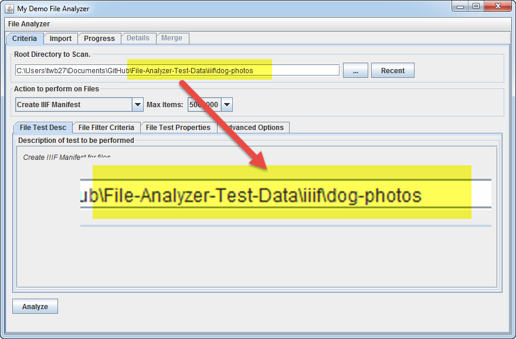
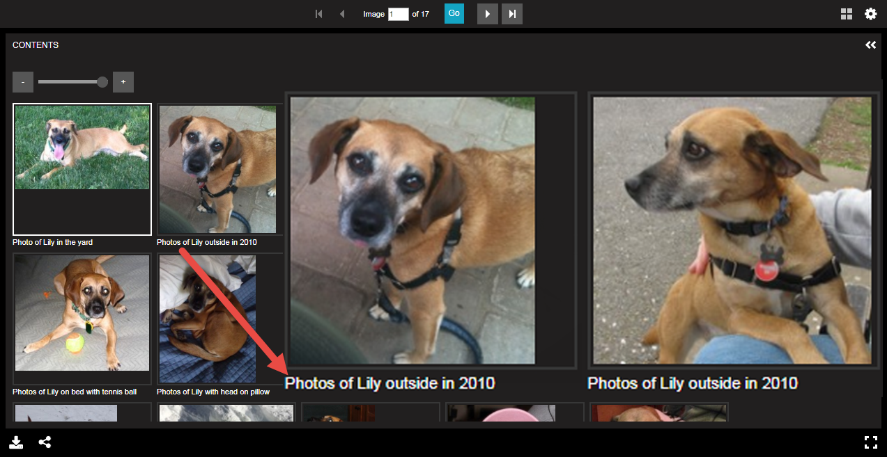

## Generating IIIF Manifests from Repository Metadata and Archival Metadata (EAD)

Terry Brady

Georgetown University Library

https://github.com/terrywbrady/info


---

### Our [First IIIF Collection](https://repository.library.georgetown.edu/handle/10822/1044538#?m=7) (Mar 2018)

- Manuscript Collection of digitized comic books
  - Recently digitized
  - Visually interesting
- Item metadata already existed in DSpace

+++ 

### Our [First IIIF Collection](https://repository.library.georgetown.edu/handle/10822/1044538#?m=7) (Mar 2018)


+++

### A future digital collection from our Law Center

- Digitized archival collection
- No item level metadata
- Conceptually difficult to imagine as items
- Only box/folder descriptive information in an EAD
- Digitized folders are named to match EAD container labels
- Informed our design

+++

### A future digital collection from our Law Center


---

### Our Approach

- Re-use metadata wherever possible
- Author Metadata where it makes the most sense
- Assemble metadata and image files to facilitate manifest generation
- Digitial Services team generates manifest files as needed
- We hope this approach is useful for other institutions
  
+++

### Reuse of Metadata


+++

### File Analyzer


---

### Demonstration of Our Manifest Generation Tool

---
### Prerequisite Software

- Clone/Install [File Analyzer](https://github.com/Georgetown-University-Libraries/File-Analyzer)
- Clone [File Analyzer Test Data](https://github.com/Georgetown-University-Libraries/File-Analyzer-Test-Data)
- IIIF Image Server such as Loris or Cantaloupe to serve 
- Web Server (manifests and universal viewer) 

+++

### Configure Manifest Generator for Your Local Environment
- Make a local copy of the Manifest Generator Property File 
- Configure the manifestGenerate.prop file for your environment

---

### Manifest Generation Property File

@ul

- URL/Path Configuration
- Manifest Properties
- One Manifest or Collection of Manifests
- Where to Find Metadata

@ulend

---
### Manifest Generation Property File - Paths
- Root URL to IIIF Server
- Where to write the manifest file

+++

### URL Prefix for Image Resources

    # URL Prefix to prepend to IIIF resource URL's for this project
    IIIFRoot: https://YOUR-IMAGE-SERVER-URL/project-path

+++

### Manifest Output Directory

    # Manifest Output Directory
    # If blank, the current dir will be used
    # Enter the path as a linux style path even for windows
    #   \\server\share\path --> //server/share/path
    ManifestOuputDir: //YOUR-SERVER-PATH/IIIF/manifests

+++

### Manifest Output File Name

    # Manifest Output File
    # Name of the top level manifest file that will be generated
    ManifestOuputFile: dog-photos.json

---

### Manifest Generation Property File - Properties

- General Manifest Properties
- Manifest Level Metadata

+++

### Directory Separator for subfolders of image assets

    # IIIF Directory Separator.
    #  - "/" (default)
    #  - "%2F" may be needed for Cantaloupe Server.
    #DirectorySeparator: /
    DirectorySeparator: %2F

+++

### Manifest Logo

    # Manifest Logo URL
    # URL to a logo image to embed within the manifest
    ManifestLogoURL: 

+++

### Boilerplate Metadata

    # Manifest Metadata 
    # - If not defined in another external metadata file
    Title: Sample Manifest File with Dog Photos 
    Attribution: Sample file illustrating File Analyzer functionality
    DateCreated: 2017-12-12
    Creator: Terry Brady, Georgetown University Library
    #Description:
    #Rights: 

---

### Manifest Generation Property File - Collections

- Construct one manifest or a collection of manifests

+++

### Collection manifest configuration

    # Create Collection Manifest - An individual manifest will be generated for each subfolder 
    # and registered in a collection level manifest
    #  - NoCollection: No collection manifest will be created (default)
    #  - OneItemPerFolder: Only one item per folder, use item name for folder name
    #  - ManyItemsPerFolder: Many items will exist per folder
    #CreateCollectionManifest: NoCollection
    #CreateCollectionManifest: OneItemPerFolder
    #CreateCollectionManifest: ManyItemsPerFolder
@[6](On manifest will be created - no collections)
@[7](All assets in a folder will share item metadata)
@[8](Each asset in a folder may have distinct metadata)
   
---

### Manifest Generation Property File - Metadata

- Where to find metadata?
  - One Common Location
  - Item Specific Locations

+++

### Item Metadata Location

    # Get Item Metadata
    # - ItemMetadataFile - extract metadata from a file
    #   - mets.xml from DSpace AIP export
    #   - dublin_core.xml from DSpace Simple Archive Format metadata file
    # - ManfiestMetadataFile - manifest level file containing metadata for all items
    #   - CSV files
    # - RESTAPI - extract metadata using the DSpace REST API
    # - None - no metadata file exists
    #GetItemMetadata: RESTAPI
    GetItemMetadata: None
    #GetItemMetadata: ItemMetadataFile
    #GetItemMetadata: ManifestMetadataFile 

@[10](Descriptive metadata does not exist for each asset)
@[12](Descriptive metadata will be pulled from a common file)
@[11](Descriptive metadata will be pulled from an item specific metadata file)
@[9](Descriptive metadata will be pulled from the DSpace REST API)

+++

###  Item Identifier Calculation

    # Get Item Identifier
    # - ItemMetadataFile - extract metadata from an item-specific file
    #   - mets.xml from DSpace AIP export
    #   - dublin_core.xml from DSpace Simple Archive Format metadata file
    # - FolderName - folder name contains item identifier
    # - FileName - file name contains item identifier
    #GetItemIdentifer: ItemMetadataFile
    #GetItemIdentifier: FolderName
    GetItemIdentifier: FileName

@[7](Item identifier will be defined in a metadata file associated with an image asset)
@[8](Item identifier will be derived from the name of the folder containing an image asset)
@[9](Item identifier will be derived from the file name of the image asset)


+++

### Common metadata file name - applies to all items

    # Manifest Metadata 
    # Manifest Metadata Input File
    # - EAD File containing metadata
    # - CSV File for each input directory of resources
    # If blank, this property file will be utilized
    #ManifestMetadataInputFile: 
    #ManifestMetadataInputFile: dogPhotosEAD.xml
    #ManifestMetadataInputFile: dogPhotosEADWithLinkedDAO.xml
    #ManifestMetadataInputFile: metadata.csv

@[6](No master metadata file - individual locations for each item)
@[7-8](EAD XML file containing metadata)
@[9](CSV file containing metadata for multiple items)

---

### Manifest Generation Property File

- Project Specific Formatting
  - Range Construction (date, container, project specific)
  - Label Formatting
  - Identifier extraction

+++

### Conversion class name - references a java enum class name

    # Manifest Project
    # Name of the Manifest Project (in code) class that will provide custom translation.
    # If blank, a default value will be assigned.
    # The class should be the name of an Enum that implements ManifestProjectTranslateEnum
    #ManifestProject: 

---

### Manifest Builder Tutorial Demo

[IIIF Manifest Builder Tutorial](http://georgetown-university-libraries.github.io/File-Analyzer-Test-Data/iiif/)

---

### Demo File Listing

    ./dog-photos/box_01/2006/IMG_0063.jpg
    ./dog-photos/box_01/2010/IMG_1063.jpg
    ./dog-photos/box_01/2010/dog1.jpg
    ./dog-photos/box_01/2013/IMG_3999.jpg
    ./dog-photos/box_01/2015/IMG_2159.jpg
    ./dog-photos/box_02/2006/IMG_1448.jpg
    ./dog-photos/box_02/2009/IMG_0168.jpg
    ./dog-photos/box_02/2014/IMG_5534.jpg
    ./dog-photos/box_02/2015/IMG_3749.jpg
    ./dog-photos/box_03/2009/IMG_0941.jpg
    ./dog-photos/box_03/2014/IMG_4970.jpg
    ./dog-photos/box_03/2017/IMG_0908.jpg
    ./dog-photos/box_04/2006/IMG_1800.jpg
    ./dog-photos/box_04/2009/IMG_0204.jpg
    ./dog-photos/box_04/2013/IMG_4591.jpg
    ./dog-photos/box_04/2015/IMG_5032.jpg
    ./dog-photos/box_04/2016/IMG_9030.jpg

@[1-5](Box 1 files)
@[2-3](Box 1 files from 2010)
@[6-9](Box 2 files)
@[10-12](Box 3 files)
@[13-17](Box 4 files)

---
#### Basic Manifest


+++

### File Analyzer - Criteria

- File Test Name
  - "Create IIIF Manifest"

+++


+++


+++

### File Analyzer - Root Directory

- Set Root Directory to 
  - iiif/dog-photos

+++


+++



+++

### File Analyzer - Properties 

- Manifest Generate Property Filename
  - manifestGenerate.prop
  - this is the name of the file that we edited

+++


+++


+++

### Click Analyze to Generate the Manifest

+++


+++

### The results will display in a table describing the items found

+++


+++


+++

### Preview the Manifest in the Universal Viewer

Note that the image filenames are used as canvas labels.

+++


+++


---

###  Manifest with Item Metadata


+++

### UpdatemanifestGenerate.prop

```
    # Get Item Metadata
    # - ItemMetadataFile - extract metadata from a file
    GetItemMetadata: ItemMetadataFile
```

+++

### Click Analyze to Generate the Manifest

+++


+++

Review the results. Note that title information is extracted for each item

+++


+++


+++

### Preview the results in Universal Viewer

- Note the descriptive metadata in the right-hand panel.
- Note the descriptive canvas names.

+++


+++


+++


+++



---

### Manifest with Date Ranges


+++

### In File Analyzer - File Test Properties

- Set Project Value Translator to 
  - "ByCreationDate"

+++


+++


+++

### Click Analyze to Generate the Manifest

+++

Note the sequence and range information assigned to each image.

+++


+++


+++

### Preview the results in Universal Viewer

Note the date ranges present on the left hand side.

+++


+++


--- 
### Manifest with Folder Ranges


+++

### In File Analyzer - File Test Properties

- Set Project Value Translator to 
  - "ByFolderName"

+++


+++


+++

### Click Analyze to Generate the Manifest

+++

Note the sequence and range information assigned to each image.

+++


+++


+++

### Preview the results in Universal Viewer

- Note the file system folder structure present on the left hand side.

+++


+++


---

### Manifest with EAD Subject Ranges


+++

### Sample EAD 

    <dsc>
      <c01 id="ref0" level="series">
        <did>
          <unittitle>Sample Dog Photos</unittitle>
        </did>
        <c02 id="ref1" level="file">
          <did>
            <unittitle>Dog Outside</unittitle>
          </did>
          <c03 id="ref1y" level="file">
            <did>
              <unittitle>Young Dog</unittitle>
              <container id="cid395001y" type="Box" label="Text">1</container>
              <container parent="cid395001y" type="Folder">2000-2009</container>
              
@[2-5](Level 1)
@[4](Level 1 Title)
@[6-9](Level 2)
@[8](Level 2 Title)
@[10-14](Level 3)
@[12](Level 3 Title)
@[13](Box directory name is matched to the container label)
@[14](Folder directory name is matched to the container label range)

+++ 

### Update manifestGenerate.prop

```
    # Manifest Metadata Input File
    ManifestMetadataInputFile: dogPhotosEAD.xml
```

+++

This translator assumes that all input folders have been matched to EAD containers

+++

### In File Analyzer - File Test Properties

- Set Project Value Translator to 
  - "EADFolderMapSubjectsOnly"

+++

### Click Analyze to Generate the Manifest

+++


+++


+++

### Preview the results in Universal Viewer

Note the EAD hierarchy present on the left hand side.

+++


---

### Manifest Metadata from a CSV


+++

### Sample CSV: metadata.csv

    "Key",dc.title,dc.date.created
    "IMG_0063.jpg","Title A",2006
    "IMG_1063.jpg","Title B",2010
    "dog1.jpg","Title C",2010
    "IMG_3999.jpg","Title D",2013
    "IMG_2159.jpg","Title E",2015
    "IMG_1448.jpg","Title F",2006
    "IMG_0168.jpg","Title G",2009
    "IMG_5534.jpg","Title H",2014
    "IMG_3749.jpg","Title I",2015
    "IMG_0941.jpg","Title J",2009
    "IMG_4970.jpg","Title K",2014
    "IMG_0908.jpg","Title L",2017
    "IMG_1800.jpg","Title M",2006
    "IMG_0204.jpg","Title N",2009
    "IMG_4591.jpg","Title O",2013
    "IMG_5032.jpg","Title P",2015
    "IMG_9030.jpg","Title Q",2016

+++

### Update manifestGenerate.prop

```
    # Manifest Metadata Input File
    ManifestMetadataInputFile: metadata.csv
```

```
    # Get Item Metadata
    GetItemMetadata: ManifestMetadataFile
```

+++

### In File Analyzer - File Test Properties

- Set Project Value Translator to 
  - "Default"

+++

### Click Analyze to Generate the Manifest

+++

### Preview the results in Universal Viewer

Note that the metadata was pulled from the CSV file (using the filename as a matching key)

+++


+++


---

### Generate a Collection Manifest


+++

### Update manifestGenerate.prop

```
    # Create Collection Manifest - An individual manifest will be generated for each subfolder 
    CreateCollectionManifest: ManyItemsPerFolder
```

```
    # Get Item Metadata
    GetItemMetadata: ItemMetadataFile
```
+++

### In File Analyzer - File Test Properties

- Set Project Value Translator to 
  - "ByItemFolderName"

+++

### Click Analyze to Generate the Collection Manifest and Folder Manifests

+++

### Preview the results in Universal Viewer

Note that the images have been broken into individual manifests for each box.

+++


---

### Try it Yourself

- Try the [tutorial](http://georgetown-university-libraries.github.io/File-Analyzer-Test-Data/iiif/) yourself
- Let me know your results
- How well does this model your use cases?

---

### Thank You

Terry Brady

Georgetown University Library

https://github.com/terrywbrady/info


