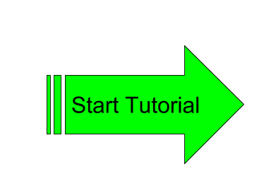

# File-Analyzer-Test-Data

This repository contains sample data that illustrates how to use the File Analyzer application.

## [IIIF Manifest Builder Tutorial](iiif/README.md)

Sample data files to illustrate the capabilities of the File Analyzer (http://georgetown-university-libraries.github.io/File-Analyzer/)

## [File Analyzer Training](https://github.com/Georgetown-University-Libraries/File-Analyzer/wiki/File-Analyzer-Training-Code4Lib-2015#try-it-yourself)

Overview tutorial illustrating the basic functionality of the File Analyzer.

***
[Georgetown University Library IT Code Repositories](http://georgetown-university-libraries.github.io/)
