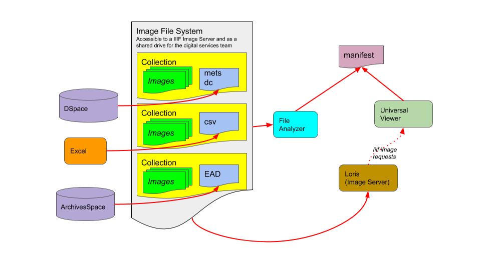

# Generating IIIF Manifests with File Analyzer



[&#x21E8; Start Tutorial &#x21E8;](https://Georgetown-University-Libraries.github.io/File-Analyzer-Test-Data/iiif)

This tutorial is designed to demonstrate how to generate metadata-rich IIIF Manifest files using the File Analyzer.

[Overview Presentation: Building IIIF Manifests with File Analyzer](https://gitpitch.com/Georgetown-University-Libraries/testManifests#/)

The initial version of this application was built to leverage metadata authored in DSpace and ArchivesSpace.  Support for other metadata sources could be defined.

The File Analyzer is a Java Swing desktop application.  The application assumes that the end user has desktop access to image files and metadata to be merged into a manifest file.  If the application is to be run against a remote file system, some window emulation will be needed to initiate a session.

## Demonstration Video


