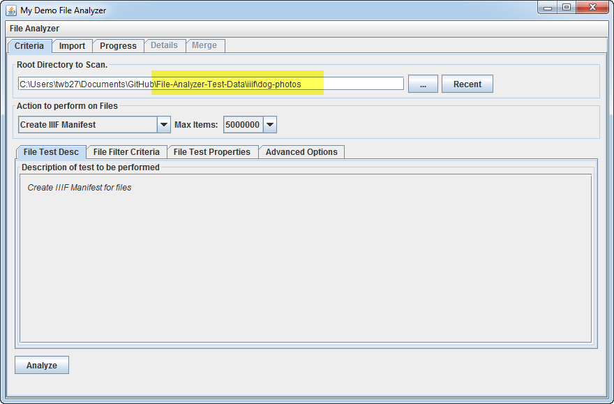
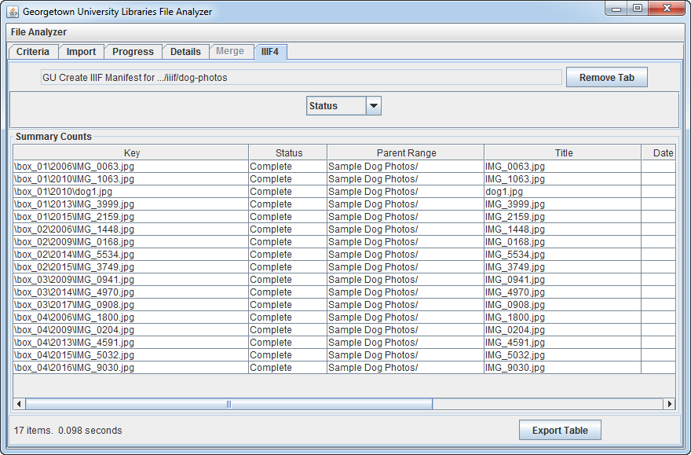
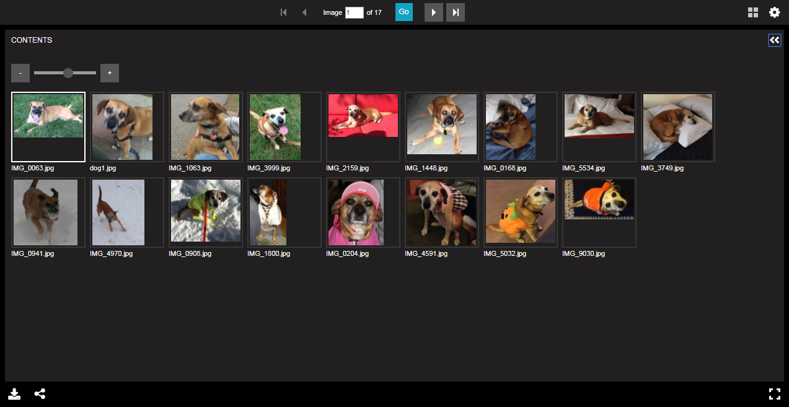

# Generate Basic Manifest

[Main Menu](README.md) | [Next](demo2.md) 
------------------------- | ------------------------- 

### Select "Create IIIF Manifest" from the dropdown on the "Criteria" panel

### Set "Root Directory" to the dog-photos directory

### On the "File Test Properties Tab", note the options that exist. 
The "Manifest Generate Property Filename" should match the name of the file that you modified.

### Click "Analyze"

### The results will display in a table describing the items found

## Step 6: Preview the Manifest in the Universal Viewer

Note that the image filenames are used as canvas labels.

[Main Menu](README.md) | [Next](demo2.md) 
------------------------- | ------------------------- 
