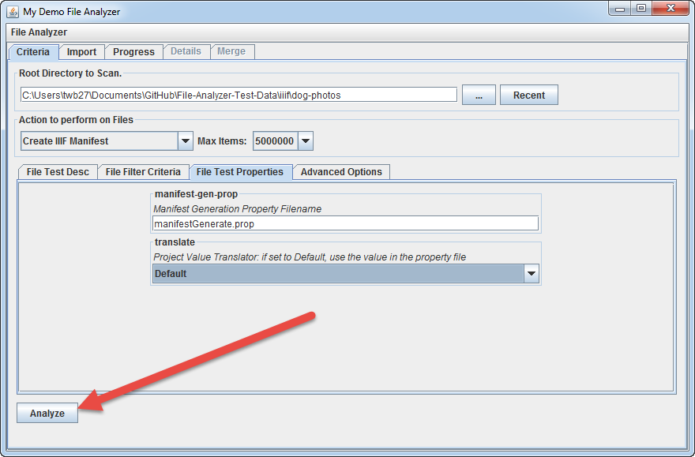
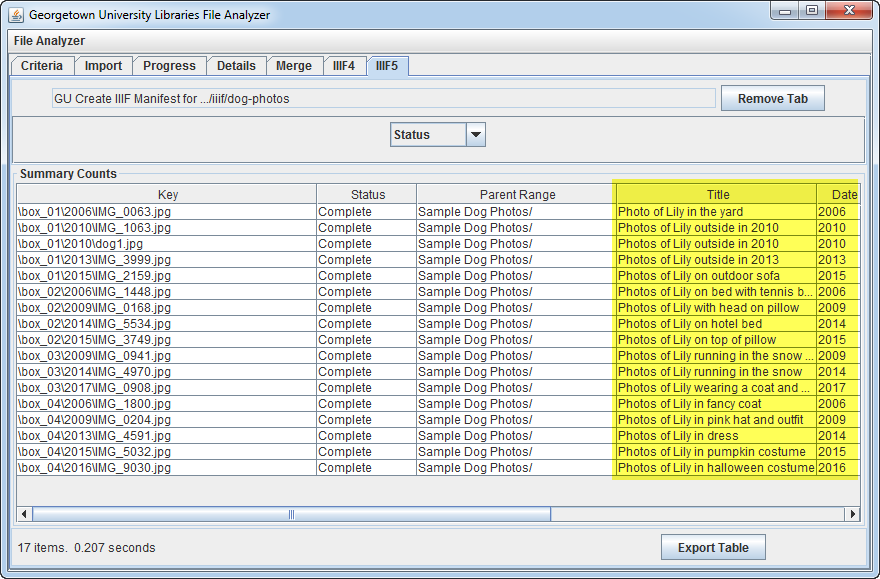
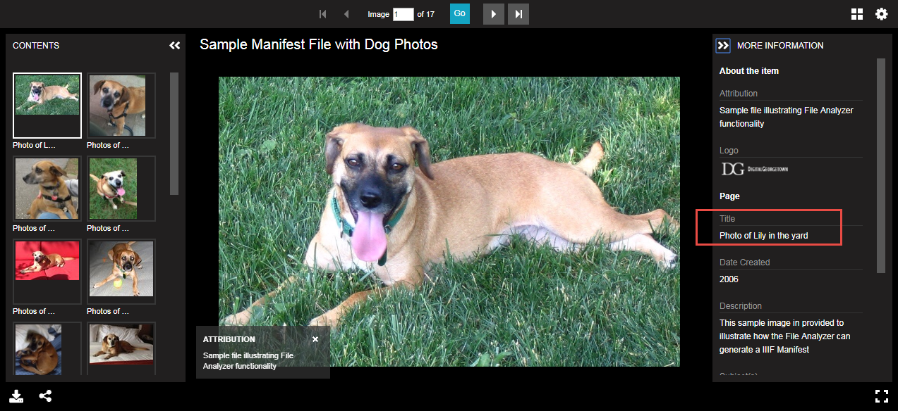
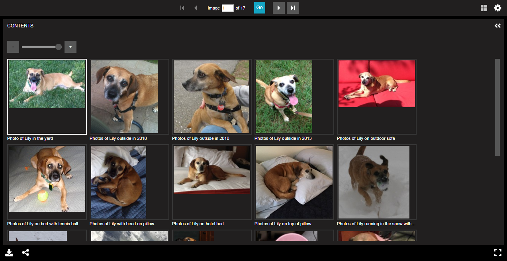

# Generate Manifest with Item Metadata

The Create Manifest Builder is able to merge item metadata into the manifest file as it is being generated.  

Since this application was built to support content described in DSpace, the following metadata formats are supported.

* DSpace metadata input file: dublin_core.xml
* DSpace AIP export file: mets.xml
* Future Support
  * CSV File 
  * DSpace REST API 
  * Embedded metadata within images

[Main Menu](README.md) | [Next](demo3.md) 
------------------------- | ------------------------- 

## Step 1: In manifestGenerate.prop, set GetItemMetadata to "MetadataFile"

    # Get Item Metadata
    # - ItemMetadataFile - extract metadata from a file
    #   - mets.xml from DSpace AIP export
    #   - dublin_core.xml from DSpace Simple Archive Format metadata file
    # - ManfiestMetadataFile - manifest level file containing metadata for all items
    #   - CSV files
    # - RESTAPI - extract metadata using the DSpace REST API
    # - None - no metadata file exists
    #GetItemMetadata: RESTAPI
    #GetItemMetadata: None
    GetItemMetadata: ItemMetadataFile
    #GetItemMetadata: ManifestMetadataFile    

## Step 2: Re-run the Create IIIF Manifest task in File Analyzer (click Analyze)

## Step 3: Review the results. Note that title information is extacted for each item

## Step 4: Preview the results in Universal Viewer

Note the descriptive metadata in the right-hand panel.

Note the descriptive canvas names.

	
[Main Menu](README.md) | [Next](demo3.md) 
------------------------- | ------------------------- 
