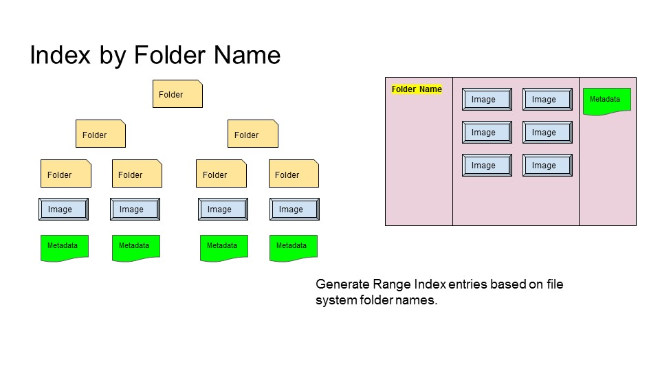
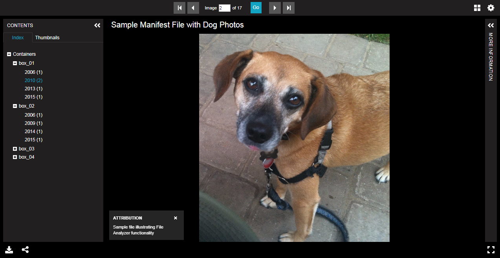

# Generate Manifest with Folder Ranges



In this example, we will use a special project translation class to replicate the folder structure as ranges within the manifest.

## Step 1: On the "File Test Properties" tab of "Criteria" tab, set Project Value Translator to "ByFolderName"

Then click "Analyze"...

Note the sequence and range information assigned to each image.

## Step 2: Preview the results in Universal Viewer

Note the file system folder structure present on the left hand side.

 
