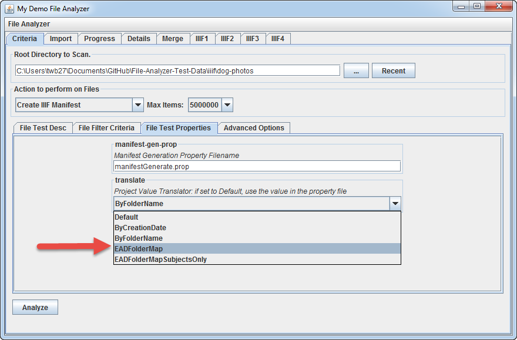

# Generate Manifest with EAD Subject + Folder Ranges



In this example, we will use use an EAD file to build project metadata and project ranges.  

The named folders of images are linked to EAD components by box and folder numbers.

## Step 1: In manifestGenerate.prop, set ManifestMetadataInputFile to "[dogPhotosEAD.xml](dog-photos/dogPhotosEAD.xml)"

    # Manifest Metadata Input File
    # - EAD File containing metadata
    # - CSV File for each input directory of resources
    # If blank, this property file will be utilized
    ManifestMetadataInputFile: dogPhotosEAD.xml
    #ManifestMetadataInputFile: dogPhotosEADWithLinkedDAO.xml
    #ManifestMetadataInputFile: metadata.csv

## Step 2: On the "File Test Properties" tab of "Criteria" tab, set Project Value Translator to "EADFolderMap"

Then click "Analyze"...

## Step 3: Preview the results in Universal Viewer

Note the EAD hierarchy and file system folder structure present on the left hand side.


