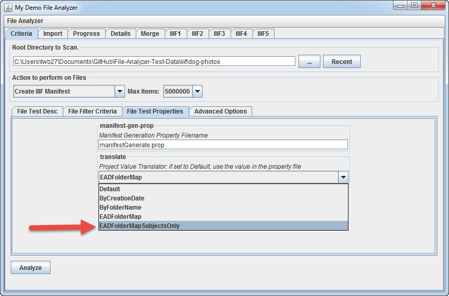
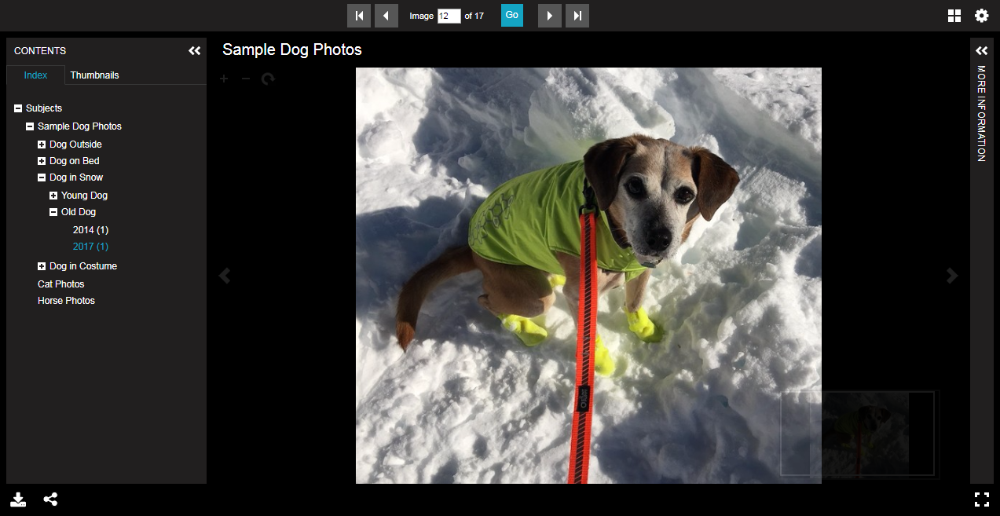

# Generate Manifest with EAD Subject Ranges

[Main Menu](README.md) | [Next](demo7.md) 
------------------------- | ------------------------- 

In this example, we will modify the range listing from the prior example with a different project translator.  

The named folders of images are linked to EAD components by box and folder numbers.

## Step 1: On the "File Test Properties" tab of "Criteria" tab, set Project Value Translator to "EADFolderMapSubjectsOnly"

Then click "Analyze"...

## Step 3: Preview the results in Universal Viewer

Note the EAD hierarchy present on the left hand side.

[Main Menu](README.md) | [Next](demo7.md) 
------------------------- | ------------------------- 
