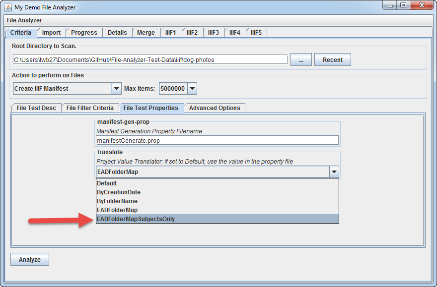
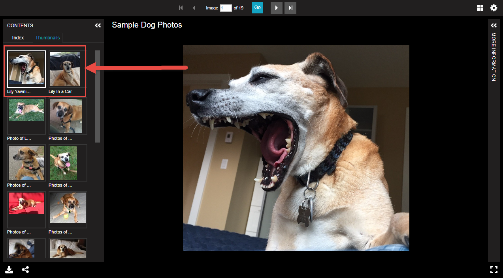
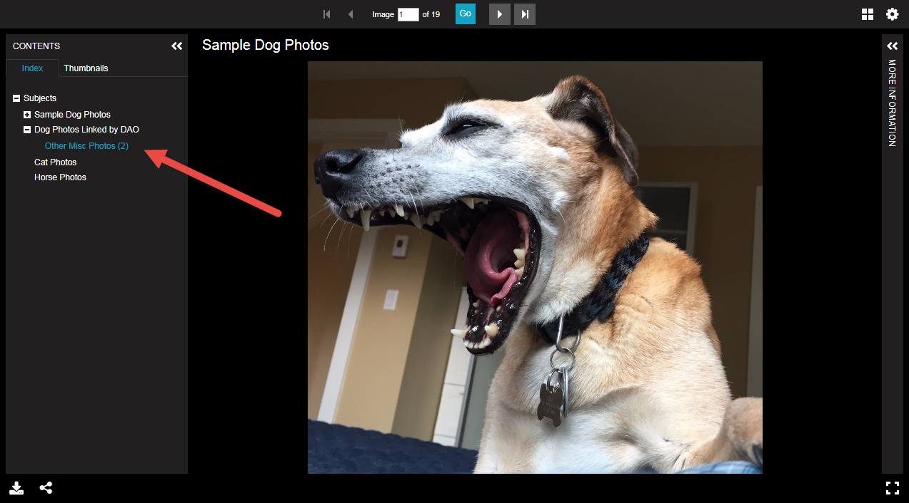

# Generate Manifest with EAD Subject Ranges and Digital Object References

[Main Menu](README.md) | [Next](demo6.md) 
------------------------- | ------------------------- 

In this example, we will also include digital objects (DAO's) defined within the EAD into the manifest.

## Step 1: In manifestGenerate.prop, set ManifestMetadataInputFile to "[dogPhotosEADWithLinkedDAO.xml](dog-photos/dogPhotosEADWithLinkedDAO.xml#L135-L145)"

    # Manifest Metadata Input File
    # - EAD File containing metadata
    # - CSV File for each input directory of resources
    # If blank, this property file will be utilized
    #ManifestMetadataInputFile: dogPhotosEAD.xml
    ManifestMetadataInputFile: dogPhotosEADWithLinkedDAO.xml

## Step 2: On the "File Test Properties" tab of "Criteria" tab, keep the Project Value Translator to "EADFolderMapSubjectsOnly"

Then click "Analyze"...

## Step 3: Preview the results in Universal Viewer

Note the additional items that have been imported by Digital Object URL in the EAD.

[Main Menu](README.md) | [Next](code.md) 
------------------------- | ------------------------- 
