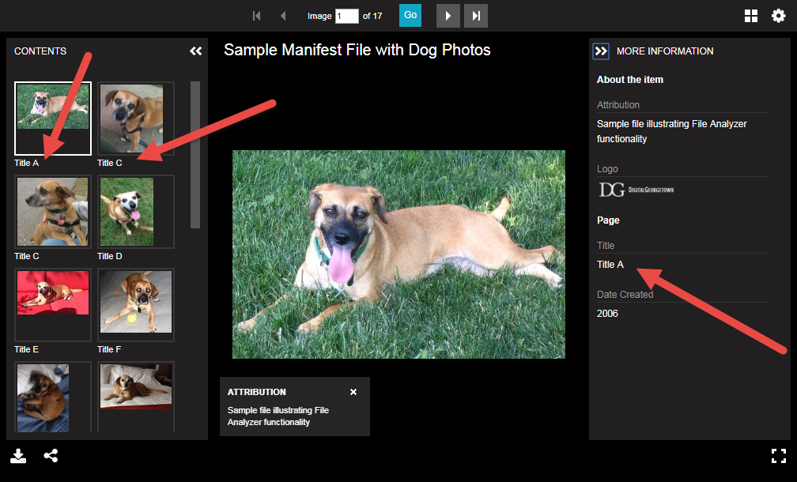

# Generate Manifest Metadata from a CSV

 

In this example, we will use a CSV file to populate manifest metdata.

## Step 1: In manifestGenerate.prop, set ManifestMetadataInputFile to "[metdata.csv]({{site.src_path}}/iiif/dog-photos/metadata.csv)"

    # Manifest Metadata Input File
    ManifestMetadataInputFile: metadata.csv

## Step 2: In manifestGenerate.prop, set GetItemMetadata to "ManifestMetadataFile"

    # Get Item Metadata
    GetItemMetadata: ManifestMetadataFile

## Step 3: On the "File Test Properties" tab of "Criteria" tab, keep the Project Value Translator to "Default"

Then click "Analyze"...

## Step 4: Preview the results in Universal Viewer

Note that the metadata was pulled from the CSV file (using the filename as a matching key)

 
