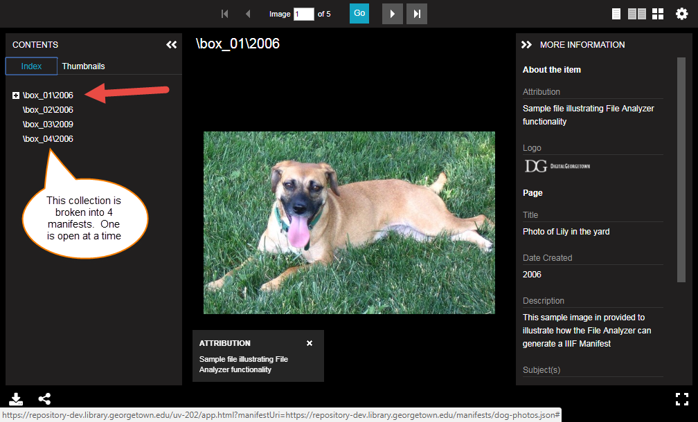
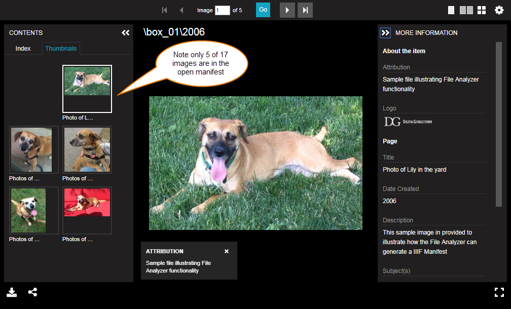
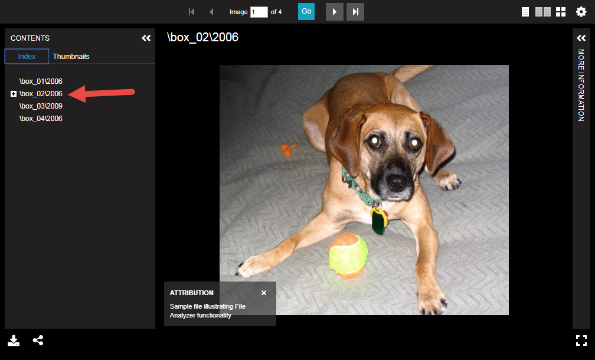
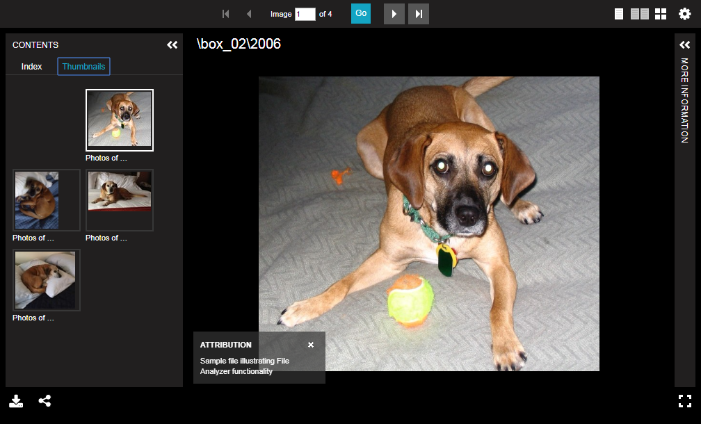

# Generate a Collection Manifest

[Main Menu](README.md) | [Next](code.md) 
------------------------- | ------------------------- 

In this example, we will generate a collection of manifests (one per each top level folder).

## Step 1: In manifestGenerate.prop, set CreateCollectionManifest to "ManyItemsPerFolder"

    # Create Collection Manifest - An individual manifest will be generated for each subfolder 
    # and registered in a collection level manifest
    #  - NoCollection: No collection manifest will be created (default)
    #  - OneItemPerFolder: Only one item per folder, use item name for folder name
    #  - ManyItemsPerFolder: Many items will exist per folder
    #CreateCollectionManifest: NoCollection
    #CreateCollectionManifest: OneItemPerFolder
    CreateCollectionManifest: ManyItemsPerFolder

## Step 2: In manifestGenerate.prop, set GetItemMetadata to "ItemMetadataFile"

    # Get Item Metadata
    # - ItemMetadataFile - extract metadata from a file
    #   - mets.xml from DSpace AIP export
    #   - dublin_core.xml from DSpace Simple Archive Format metadata file
    # - ManfiestMetadataFile - manifest level file containing metadata for all items
    #   - CSV files
    # - RESTAPI - extract metadata using the DSpace REST API
    # - None - no metadata file exists
    #GetItemMetadata: RESTAPI
    #GetItemMetadata: None
    GetItemMetadata: ItemMetadataFile
    #GetItemMetadata: ManifestMetadataFile

## Step 3: On the "File Test Properties" tab of "Criteria" tab, keep the Project Value Translator to "Default"

Then click "Analyze"...

## Step 4: Preview the results in Universal Viewer

Note that the images have been broken into individual manifests for each box.

[Main Menu](README.md) | [Next](code.md) 
------------------------- | ------------------------- 
