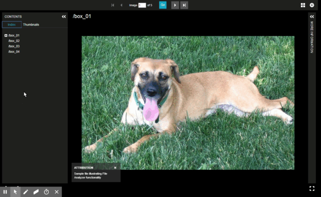

# Generate a Collection Manifest

 

In this example, we will generate a collection of manifests (one per each top level folder).

## Step 1: In manifestGenerate.prop, set CreateCollectionManifest to "ManyItemsPerFolder"

    # Create Collection Manifest - An individual manifest will be generated for each subfolder 
    CreateCollectionManifest: ManyItemsPerFolder

## Step 2: In manifestGenerate.prop, set GetItemMetadata to "ItemMetadataFile"

    # Get Item Metadata
    GetItemMetadata: ItemMetadataFile

## Step 3: On the "File Test Properties" tab of "Criteria" tab, keep the Project Value Translator to "ByItemFolderName"

Then click "Analyze"...

## Step 4: Preview the results in Universal Viewer

Note that the images have been broken into individual manifests for each box.

 
